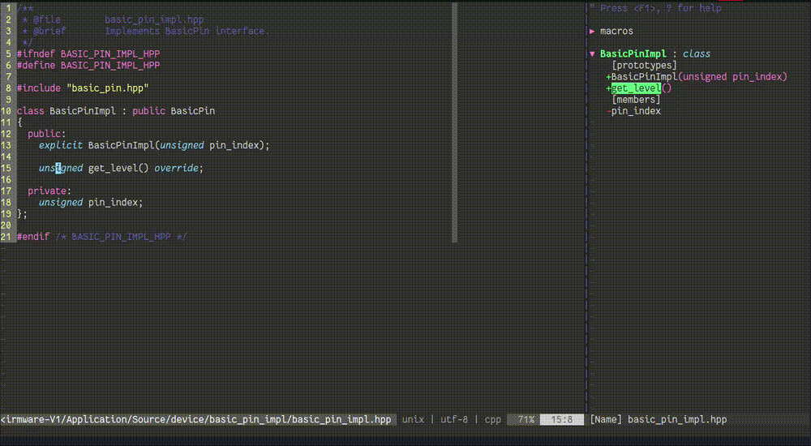
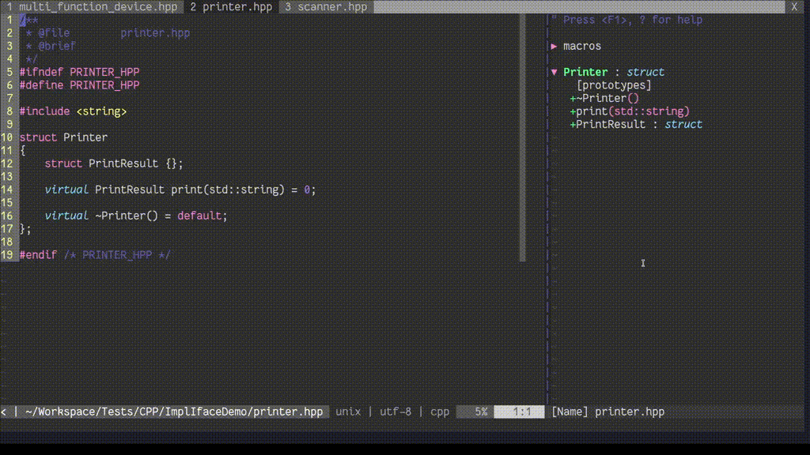

# TsepepeVim plugin for Vim

This is a tiny C++ refactoring plugin which currently supports:

* function definition generation from a function declaration,
* implementing an interface (extending a class with an abstract class)
* switching to the corresponding (paired) C++ file, with the same stem

This plugin uses [Tsepepe](https://github.com/KKoovalsky/Tsepepe) toolset, which must be compiled along with the
bundled plugin to properly work. This is explained later in the [Installing section](#installing).

Uses `libclang`. May be slow in large codebases, but everything is lazy evaluated, so the only slowness you might
experience while explicitly invoking the plugin's commands.

**NOTE:** Requires compilation database.

## Features

### Function definition generation

- Finds corresponding (paired) C++ file and appends the definition to it.
- Takes into account all the specifiers, attributes, default parameters, namespaces, nested classes, nested types, etc.
Knows what to skip and what to keep.



### Implement interface

- Finds the interface (abstract class) with the specifed name within the project.
- Adds an include statement, if not yet present, extends the base-clause with the qualified name of the interface,
and adds `override` declarations of the pure virtual methods.



### Go to corresponding file

This feature is similar to the clangd's "Switch between source/header".

## Requirements

System-wide:

* GCC 12.1.0+
* CMake 3.22
* `libclang-14-dev` and `libllvm-14-dev`
* `libboost-1.74`+
* `ripgrep`

## Installing

With `vim-plug`, put that inside inside `.vimrc`:

```
Plug 'KKoovalsky/TsepepeVim', { 'do': './build.py' }
```

When installing other way, remember that the `Tsepepe` toolset must be built within the directory where the 
plugin is dropped:

```
cd to/the/plugins/dir
git submodule update --init --recursive
./build.py
```

## Documentation

See [doc/tsepepe.txt](doc/tsepepe.txt).

## Running tests

```
cd tests
behave compile_command_database_directory_path_getter/
```

## TODO

* Generate multiple function definitions using visual line mode.
* Generate declaration from a definition, or a function call (invocation).
* Update function definition / declaration.
